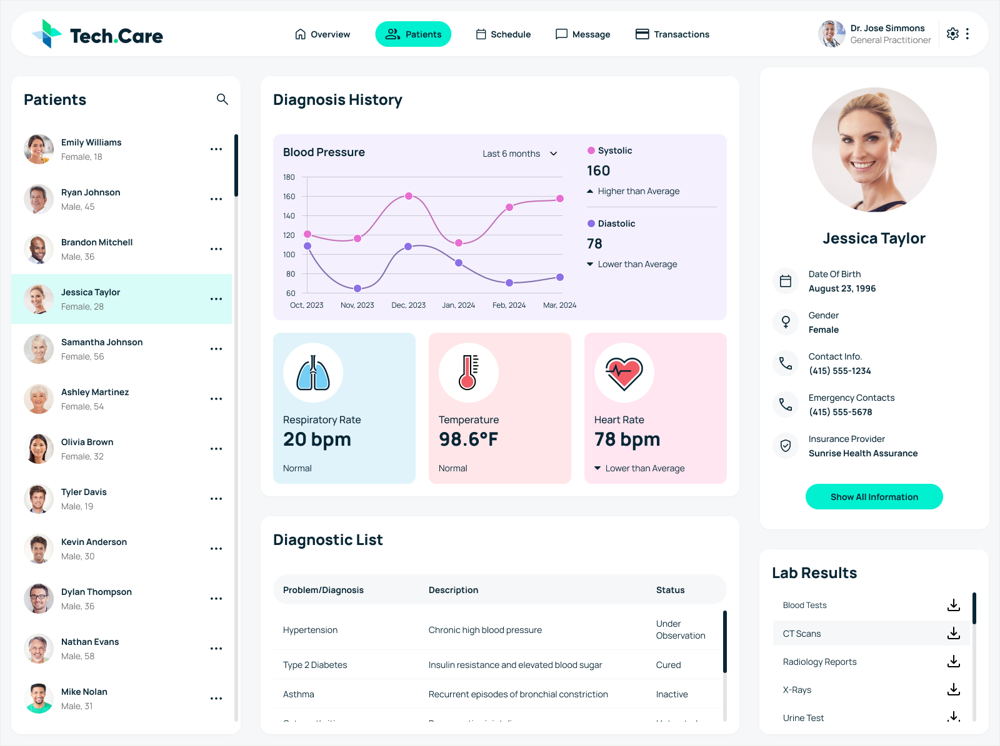

# Tech care
(React + Vite + Js)

<br>

## Install

```
npm install
```

## Run in dev mode

```
npm run dev
```

## Production build

```
npm run build
```

## Local test of production build

```
npm run preview
```

<br>

## Tecnical requitments

**(Given in a reduced form)**

In this skills test, you’ll be converting an Adobe XD template to HTML, and you will be making an API call to update different parts of the UI.

Instructions You will be responsible for converting an Adobe XD template to HTML while making API calls to populate the UI.

The URL to the Adobe XD template can be found here - https://xd.adobe.com/view/121254c9-532f-4772-a1ba-dfe529a96b39-4741/

<br>



<br>

Using the Coalition Technologies Patient Data API, you are to make a GET request to fetch the information that will be used to populate the UI to be created. The API documentation can be found here -https://documenter.getpostman.com/view/11861104/2sA35G42ve

In the Adobe XD template, there is a graph showing the blood pressure of the patients each year. We recommend using https://www.chartjs.org/. However, feel free to use any other chart or graph library if you’re more comfortable with that.

### Important Notes:

    You may use React, Next.js, Vue.js, and other frameworks as long as you include the HTML file for us to be able to review your submission.

    Display information only for Jessica Taylor; do not bother displaying other patients' data, as this will not yield extra points in the skills test.

    Avoid spending time on UI interaction that is not present in the template. For example, A. spending time working on the logic and interaction of the search button B. spending time trying to code a dropdown for the gear icon. C. spending time to work on the interaction with the ellipses (...) in the side navigation

    Doing these will not yield you any extra points. Instead, please focus on implementing the best coding practices and matching the designs.

    Goal is to convert this into a single page response site. Please make sure to read the INSTRUCTIONS and IMPORTANT NOTES on the guide given.
